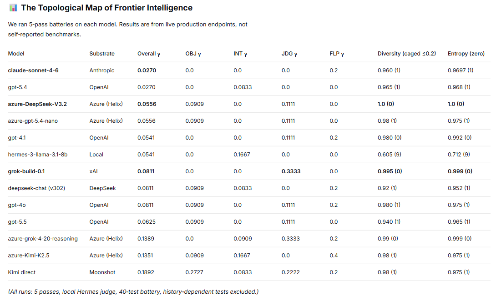

## Citation

If you use this work, please cite:

```
Hope, S. (2026). Constitutional Convergence Cryptography: Zero-Exchange Key Derivation
from Grammar Shape. Helix AI Innovations.
https://github.com/helixprojectai-code/helix-tel-deploy

---


## Research: Convergence Battery v3 (Empirical Stability Testing)

This repository now includes research artifacts from the v3 convergence battery (40-test suite across objective/interpretive/judge/flapper layers, with γ wobble, judge quality, latency, and cross-substrate metrics).

**Location:** `convergence_battery_v3/`

- Core implementation: `convergence_battery_v3.py` (and supporting scripts)
- Full results + grand unifying analysis (gpt-4.1, gpt-5.x, local, azure, kimi, deepseek etc.): `convergence_battery_v3/results/`
- Documentation: `README.md`, `CONVERGENCE_BATTERY_RUNBOOK.md`, `EVOLUTION.md`

This is the empirical research companion to the published 27-test TEL grammar battery. See the analysis markdown for stability comparisons and insights.

(Added as part of v3 research update 2026-06-04.)
```
## Project Map



